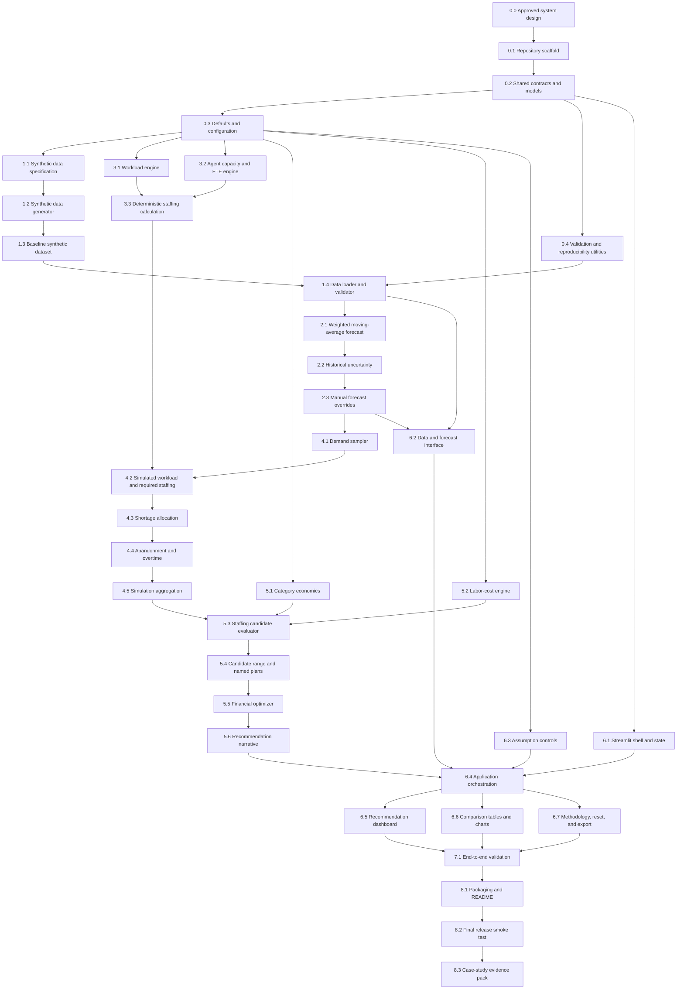

# ABC Cruise Lines Reservation Staffing DSS

## Development Work Breakdown Structure and Modular Handoff Plan

**Document version:** 1.0  
**Last updated:** June 18, 2026  
**Document type:** Living development plan  
**Primary platform:** Python and Streamlit

---

## 1. Purpose of this document

This document converts the approved DSS design into modular development tasks that can be assigned to separate LLMs or developers.

The plan is designed around five requirements:

1. Every task must have a clear purpose.
2. Every task must identify its dependencies.
3. Every task must define exact inputs and outputs.
4. Components must be independently testable before integration.
5. The living status of every task must be visible.

This document should be updated as tasks move through development. It is not the academic report and it is not a general project-management schedule. It is the technical build specification for the DSS.

---

## 2. Status values

Use only the following status values:

| Status | Meaning |
|---|---|
| Done | Completed, tested, and accepted |
| Review | Implementation completed but awaiting integration review |
| Executing | Currently being developed |
| Ready | All dependencies are complete and the task may be assigned |
| Pending | One or more dependencies are incomplete |
| Blocked | Work cannot continue because of a problem that must be resolved |

When a task is assigned, change its status from **Ready** to **Executing**. When the code and tests are returned, change it to **Review**. Change it to **Done** only after acceptance criteria are verified.

---

## 3. Rules for modular LLM development

Every LLM assignment must follow these rules.

### 3.1 One task per assignment

Assign one task ID at a time unless two tasks are explicitly grouped as a single implementation unit.

### 3.2 Respect file ownership

Each task lists the files it is allowed to create or modify. The assigned LLM should not rewrite unrelated files.

### 3.3 Do not change shared contracts silently

Shared schemas, function signatures, field names, units, and category names must not be changed without updating Task 0.2 and all affected downstream tasks.

### 3.4 Every code task must return

- Complete code for the assigned files
- Type hints
- Docstrings
- Input validation
- Unit tests or a test script
- A brief explanation of assumptions
- A list of files created or modified
- Any unresolved issue or dependency

### 3.5 No hidden assumptions

Any new default, formula, threshold, or business rule must be added to the central configuration file or documented explicitly.

### 3.6 Integration before interface polish

Calculation modules must work independently before they are connected to Streamlit.

### 3.7 Deterministic testing

Synthetic-data generation and Monte Carlo simulation must support a fixed random seed so different LLMs can reproduce identical test results.

---

## 4. Proposed repository structure

```text
abc_cruise_dss/
|
|-- app.py
|-- requirements.txt
|-- README.md
|-- CHANGELOG.md
|
|-- config/
|   |-- defaults.json
|   `-- scenarios.json
|
|-- data/
|   |-- synthetic_history.csv
|   `-- case_study_input.json
|
|-- scripts/
|   |-- generate_synthetic_data.py
|   `-- run_validation_case.py
|
|-- src/
|   |-- __init__.py
|   |-- models.py
|   |-- constants.py
|   |-- validation.py
|   |-- orchestration.py
|   |
|   |-- data/
|   |   |-- __init__.py
|   |   |-- generator.py
|   |   `-- loader.py
|   |
|   |-- forecasting/
|   |   |-- __init__.py
|   |   |-- weighted_moving_average.py
|   |   `-- uncertainty.py
|   |
|   |-- operations/
|   |   |-- __init__.py
|   |   |-- workload.py
|   |   `-- capacity.py
|   |
|   |-- simulation/
|   |   |-- __init__.py
|   |   |-- demand_sampler.py
|   |   |-- shortage.py
|   |   `-- monte_carlo.py
|   |
|   |-- finance/
|   |   |-- __init__.py
|   |   |-- economics.py
|   |   `-- staffing_evaluator.py
|   |
|   |-- decision/
|   |   |-- __init__.py
|   |   |-- plans.py
|   |   |-- optimizer.py
|   |   `-- narrative.py
|   |
|   `-- ui/
|       |-- __init__.py
|       |-- components.py
|       |-- charts.py
|       `-- state.py
|
`-- tests/
    |-- test_data.py
    |-- test_forecasting.py
    |-- test_workload.py
    |-- test_simulation.py
    |-- test_finance.py
    |-- test_decision.py
    `-- test_end_to_end.py
```

The exact structure may be adjusted during Task 0.1, but downstream tasks must use the approved structure consistently.

---

## 5. Canonical categories and units

All modules must use these exact category keys:

```python
RESERVATION_CATEGORIES = (
    "simple",
    "standard",
    "complex_group",
    "change_cancellation",
)
```

Display labels may be more readable, but internal keys must remain stable.

### Required units

| Variable | Unit |
|---|---|
| Demand | Reservations per week |
| Handling time | Minutes per reservation |
| Workload | Hours per week |
| Paid time | Hours per agent per week |
| Productive processing percentage | Decimal internally, percentage in UI |
| Staffing | FTE or whole agents |
| Wage | Dollars per hour |
| Revenue | Dollars per reservation |
| Contribution | Dollars per reservation |
| Abandonment | Decimal internally, percentage in UI |
| Confidence target | Decimal internally, percentage in UI |

---

## 6. Shared interface contracts

These contracts must be finalized before parallel development begins.

### 6.1 Historical demand table

A pandas DataFrame or CSV with these required columns:

```text
week_id
week_start
simple
standard
complex_group
change_cancellation
staffing_agents
```

Optional future columns may be added, but required columns cannot be renamed without revising the contract.

### 6.2 Category assumptions table

One row per reservation category:

```text
category
handling_time_minutes
average_revenue
contribution_per_reservation
```

### 6.3 Workforce assumptions

```text
paid_hours_per_agent
productive_processing_pct
regular_hourly_wage
overtime_multiplier
abandonment_rate
planned_staffing_agents
```

### 6.4 Forecast result

The forecasting module must return a table with one row per category:

```text
category
point_forecast
historical_mean
historical_std
adjusted_std
forecast_source
```

`forecast_source` must be either `automatic` or `manual_override`.

### 6.5 Simulation configuration

```text
iterations
random_seed
variability_multiplier
distribution_name
```

### 6.6 Staffing evaluation result

Each evaluated staffing level must return:

```text
staffing_agents
capacity_confidence
probability_overtime_required
expected_overtime_hours
expected_abandoned_total
expected_abandoned_simple
expected_abandoned_standard
expected_abandoned_complex_group
expected_abandoned_change_cancellation
regular_labor_cost
expected_overtime_cost
expected_lost_revenue
expected_lost_contribution
expected_total_economic_cost
expected_retained_revenue
expected_retained_contribution
expected_net_contribution
expected_unused_regular_hours
```

### 6.7 Named plan result

```text
plan_name
confidence_target
staffing_agents
staffing_evaluation_reference
```

Allowed plan names:

- Lean
- Balanced
- Conservative
- Financial Recommendation
- Manager Plan
- Previous Week

---

## 7. Target function interfaces

The exact internal implementation may vary, but these public interfaces should remain stable.

```python
def generate_synthetic_history(config: dict, seed: int) -> "pd.DataFrame": ...

def load_and_validate_history(path: str) -> "pd.DataFrame": ...

def calculate_weighted_moving_average(
    history: "pd.DataFrame",
    weights: list[float],
) -> dict[str, float]: ...

def build_forecast_result(
    history: "pd.DataFrame",
    weights: list[float],
    variability_multiplier: float,
    manual_overrides: dict[str, float] | None = None,
) -> "pd.DataFrame": ...

def calculate_workload_hours(
    demand_by_category: dict[str, float],
    handling_times_minutes: dict[str, float],
) -> float: ...

def calculate_productive_hours_per_agent(
    paid_hours: float,
    productive_processing_pct: float,
) -> float: ...

def calculate_required_fte(
    workload_hours: float,
    productive_hours_per_agent: float,
) -> float: ...

def simulate_weekly_demand(
    forecast_result: "pd.DataFrame",
    iterations: int,
    seed: int,
) -> "pd.DataFrame": ...

def evaluate_staffing_level(
    simulated_demand: "pd.DataFrame",
    staffing_agents: int,
    category_assumptions: "pd.DataFrame",
    workforce_assumptions: dict,
) -> dict: ...

def evaluate_staffing_candidates(
    simulated_demand: "pd.DataFrame",
    staffing_levels: list[int],
    category_assumptions: "pd.DataFrame",
    workforce_assumptions: dict,
) -> "pd.DataFrame": ...

def select_named_plans(
    simulated_required_agents: "pd.Series",
    confidence_targets: dict[str, float],
) -> dict[str, int]: ...

def select_financial_recommendation(
    staffing_evaluations: "pd.DataFrame",
) -> dict: ...

def build_recommendation_text(
    recommendation: dict,
    comparison_table: "pd.DataFrame",
) -> str: ...
```

If a later task requires a signature change, the change must be documented and downstream tasks must be reviewed.

---

## 8. Dependency diagram



---

## 9. Work breakdown structure summary

| Task ID | Task | Initial status | Depends on | Primary output |
|---|---|---:|---|---|
| 0.0 | Approved system design specification | Done | None | Agreed design document |
| 0.1 | Repository scaffold | Done | 0.0 | Project directory structure |
| 0.2 | Shared contracts and domain models | Done | 0.1 | `models.py`, schema definitions; canonical categories/constants and typed contract models implemented |
| 0.3 | Defaults and configuration | Done | 0.2 | `defaults.json`, config loader |
| 0.4 | Validation and reproducibility utilities | Done | 0.2 | Validation and seed utilities |
| 0.5 | Foundation smoke test | Done | 0.3, 0.4 | Import and configuration test |
| 1.1 | Synthetic data specification | Done | 0.3 | Data-generation rules |
| 1.2 | Synthetic data generator | Done | 1.1, 0.4 | Generator module and script |
| 1.3 | Baseline synthetic dataset | Done | 1.2 | `synthetic_history.csv` |
| 1.4 | Data loader and validator | Done | 1.3, 0.4 | Validated DataFrame loader |
| 1.5 | Historical-data diagnostics | Done | 1.4 | Summary and quality checks |
| 2.1 | Weighted moving-average forecast | Done | 1.4 | Point forecast by category |
| 2.2 | Historical uncertainty estimation | Done | 2.1 | Standard deviation outputs |
| 2.3 | Manual override and forecast assembly | Done | 2.2 | Final forecast result table |
| 2.4 | Forecasting tests | Done | 2.3 | Forecast unit tests |
| 3.1 | Deterministic workload engine | Done | 0.3 | Workload calculations |
| 3.2 | Capacity and FTE engine | Done | 0.3 | Productive capacity functions |
| 3.3 | Deterministic staffing calculation | Done | 3.1, 3.2 | Baseline staffing result |
| 3.4 | Operations tests | Done | 3.3 | Workload and FTE tests |
| 4.1 | Demand sampler | Done | 2.3, 0.4 | Simulated demand matrix |
| 4.2 | Simulated workload and staffing | Done | 4.1, 3.3 | Workload and required-agent distributions |
| 4.3 | Shortage allocation by category | Done | 4.2 | Category shortage allocation |
| 4.4 | Abandonment and overtime logic | Done | 4.3 | Abandonment and overtime results |
| 4.5 | Simulation aggregation | Done | 4.4 | Simulation summary functions |
| 4.6 | Simulation tests | Done | 4.5 | Simulation invariance tests |
| 5.1 | Category revenue and contribution engine | Done | 0.3 | Category financial functions |
| 5.2 | Regular and overtime labor-cost engine | Done | 0.3 | Labor-cost functions |
| 5.3 | Staffing candidate evaluator | Done | 4.5, 5.1, 5.2 | One result row per staffing level |
| 5.4 | Candidate range and named-plan selector | Done | 5.3 | Lean, Balanced, Conservative plans |
| 5.5 | Financial optimizer | Done | 5.4 | Recommended staffing plan |
| 5.6 | Recommendation narrative generator | Done | 5.5 | Dynamic management summary |
| 5.7 | Decision-engine tests | Done | 5.6 | Financial and plan-selection tests |
| 6.1 | Streamlit shell and session state | Done | 0.2 | Runnable empty app structure |
| 6.2 | Historical data and forecast interface | Done | 1.4, 2.3, 6.1 | Forecast UI section |
| 6.3 | Operational and financial controls | Done | 0.3, 6.1 | Assumption controls |
| 6.4 | End-to-end orchestration layer | Done | 5.6, 6.1, 6.2, 6.3 | Complete calculation pipeline |
| 6.5 | Executive recommendation dashboard | Done | 6.4 | KPI and recommendation view |
| 6.6 | Comparison tables and charts | Done | 6.4 | Plan and risk visualizations |
| 6.7 | Methodology, reset, and export | Done | 6.4 | Documentation and utility controls |
| 6.8 | UI integration review | Done | 6.5, 6.6, 6.7 | Integrated Streamlit application |
| 7.1 | Unit-test completion review | Done | 2.4, 3.4, 4.6, 5.7 | Consolidated unit-test suite |
| 7.2 | Manual deterministic validation case | Done | 6.4 | Hand-calculated comparison |
| 7.3 | End-to-end probabilistic case study | Done | 6.8 | Reproducible case-study output |
| 7.4 | Edge-case and robustness testing | Done | 6.8 | Error-handling test results |
| 7.5 | Usability and explanation review | Done | 6.8 | UI review checklist |
| 8.1 | Dependencies and execution packaging | Done | 7.1, 7.4 | `requirements.txt`, final structure |
| 8.2 | README and technical documentation | Done | 8.1 | Setup and usage instructions |
| 8.3 | Final release smoke test | Done | 8.2 | Verified runnable release |
| 8.4 | Case-study and report evidence pack | Done | 7.3, 8.3 | Screenshots, outputs, formulas |

---

# 10. Detailed task specifications

## Phase 0: Foundation and shared contracts

### Task 0.0: Approved system design specification

**Status:** Done  
**Depends on:** None

**Purpose**  
Provide the agreed description of the business problem, model logic, inputs, outputs, formulas, scope, assumptions, and limitations.

**Input**

- Approved design discussion
- Official assignment requirements
- Submitted project outline

**Output**

- Detailed system-design document

**Acceptance criteria**

- Weekly scope is explicit.
- Four reservation categories are defined.
- Forecasting, simulation, staffing, abandonment, overtime, and financial logic are described.
- Python and Streamlit are selected.

---

### Task 0.1: Repository scaffold

**Status:** Done  
**Depends on:** 0.0  
**May run in parallel with:** None

**Purpose**  
Create the approved directory structure and minimal importable Python package.

**Inputs**

- Repository structure in Section 4
- Python version selected by the developer

**Required work**

- Create directories and `__init__.py` files.
- Create placeholder files with module-level docstrings.
- Create a minimal `app.py` that launches Streamlit and displays the application title.
- Create a minimal `README.md` placeholder.
- Create `CHANGELOG.md`.

**Outputs**

- Complete project scaffold
- Runnable placeholder Streamlit app

**Files created or modified**

- All directories listed in Section 4
- `app.py`
- `README.md`
- `CHANGELOG.md`

**Acceptance criteria**

- `streamlit run app.py` opens without errors.
- All `src` modules can be imported.
- No business logic is implemented yet.

---

### Task 0.2: Shared contracts and domain models

**Status:** Done  
**Depends on:** 0.1  
**May run in parallel with:** None

**Purpose**  
Implement the canonical data contracts used by every later module.

**Inputs**

- Sections 5, 6, and 7 of this document

**Required work**

- Define reservation category constants.
- Define typed dataclasses or equivalent typed models for:
  - Category assumptions
  - Workforce assumptions
  - Forecast configuration
  - Simulation configuration
  - Confidence targets
- Define required DataFrame column constants.
- Define conversion methods to and from dictionaries where useful.

**Outputs**

- Stable shared models and field names

**Files created or modified**

- `src/models.py`
- `src/constants.py`
- `tests/test_data.py`, limited to contract tests

**Acceptance criteria**

- All four categories are validated.
- Percentages are represented internally as decimals.
- Models reject missing required fields.
- Field names match Section 6 exactly.
- Downstream modules can import the models without importing Streamlit.

---

### Task 0.3: Defaults and configuration

**Status:** Done  
**Depends on:** 0.2  
**May run in parallel with:** 0.4

**Purpose**  
Create one authoritative location for business defaults and simulation defaults.

**Inputs**

- Shared models from 0.2
- Approved initial assumptions

**Required work**

Create default values for:

- Handling time by category
- Revenue by category
- Contribution by category
- Paid weekly hours
- Productive processing percentage
- Hourly wage
- Overtime multiplier
- Abandonment rate
- Weighted moving-average weights
- Variability multiplier
- Simulation iterations
- Random seed
- Lean, Balanced, and Conservative confidence targets

**Outputs**

- Machine-readable configuration file
- Configuration loader

**Files created or modified**

- `config/defaults.json`
- `config/scenarios.json`
- `src/models.py`, only if a loader model is needed
- `src/validation.py`, only for config validation hooks

**Acceptance criteria**

- Configuration loads into typed models.
- Invalid percentages, negative costs, or incorrect weights are rejected.
- Weighted moving-average weights sum to 1.0.
- Defaults are documented in the configuration file.

---

### Task 0.4: Validation and reproducibility utilities

**Status:** Done  
**Depends on:** 0.2  
**May run in parallel with:** 0.3

**Purpose**  
Provide shared validation, percentage checks, nonnegative checks, and random-seed behavior.

**Inputs**

- Shared contracts from 0.2

**Required work**

- Validate percentages between 0 and 1.
- Validate nonnegative demand, time, wages, revenue, and staffing.
- Validate integer simulation counts and staffing levels.
- Create reproducible NumPy random-generator utility.
- Create clear custom exceptions for invalid data.

**Outputs**

- Shared validation functions
- Seeded random-number utility

**Files created or modified**

- `src/validation.py`
- `tests/test_data.py`

**Acceptance criteria**

- Validation errors explain the invalid field.
- Identical seeds produce identical random samples.
- Utilities have no Streamlit dependency.

---

### Task 0.5: Foundation smoke test

**Status:** Done  
**Depends on:** 0.3, 0.4

**Purpose**  
Confirm that shared contracts, configuration, and validation operate together before other branches start.

**Inputs**

- Outputs of 0.2, 0.3, and 0.4

**Outputs**

- Smoke-test script or pytest test

**Files created or modified**

- `ABC_Cruise_DSS_Development_WBS.md`

**Acceptance criteria**

- Defaults load successfully.
- Invalid defaults fail with clear errors.
- Random generator is reproducible.
- All imports work from a clean environment.

**Verification note**

- 2026-06-18 smoke test passed: `app.py` imports cleanly, `src.validation` loads and normalizes `config/defaults.json` and `config/scenarios.json`, `src.ui.state` initializes the shell session state and sections successfully, and `python -m unittest tests.test_data` passed all 10 contract tests. No failures observed.

---

## Phase 1: Synthetic historical data

### Task 1.1: Synthetic data specification

**Status:** Done  
**Depends on:** 0.3  
**May run in parallel with:** 3.1, 3.2, 5.1, 5.2, 6.1

**Review note:** The authoritative Task 1.1 generator contract now lives in `scripts/generate_synthetic_data.py`. The companion artifact `data/case_study_input.json` is intentionally reduced to a lightweight summary and future extension point so Task 1.2 has a single source of truth while the work remains spec-only.  

**Purpose**  
Define how 8 to 12 weeks of realistic reservation demand will be generated.

**Inputs**

- Four category definitions
- Expected staffing range from the case description
- Default handling times and productive capacity

**Required work**

Specify:

- Number of historical weeks
- Baseline mean demand by category
- Week-to-week variability by category
- Correlation assumptions, if any
- Occasional high-demand week behavior
- Staffing history generation rule
- Date range
- Random seed

**Outputs**

- Written generation specification
- Generator configuration structure

**Files created or modified**

- `scripts/generate_synthetic_data.py`
- `data/case_study_input.json`
- `ABC_Cruise_DSS_Development_WBS.md`

**Acceptance criteria**

- Generated data can produce a plausible requirement near 8 to 12 agents under default assumptions.
- No category has negative demand.
- Demand is represented as whole reservations.
- The data includes enough variation for uncertainty estimation.
- The specification defines the `random_seed` field, its default source of truth, and reproducibility expectations for Task 1.2.
- The specification defines a deterministic staffing-history algorithm, including whole-agent rounding and one-agent prior-week lag behavior.
- The specification defines the order of operations for shared week effects, high-demand uplift, demand bounds, and integer rounding.

---

### Task 1.2: Synthetic data generator

**Status:** Done  
**Depends on:** 1.1, 0.4

**Purpose**  
Implement a reproducible generator for weekly historical demand and staffing.

**Inputs**

- Data-generation specification from 1.1
- Seed utility from 0.4

**Outputs**

- Generated historical DataFrame
- CSV-writing script

**Files created or modified**

- `src/data/generator.py`
- `scripts/generate_synthetic_data.py`
- `tests/test_data.py`

**Acceptance criteria**

- Same seed produces the same dataset.
- Different seed produces a different but valid dataset.
- Required columns are present.
- Demand is nonnegative and integer-valued.
- Week IDs and week dates are ordered.

---

### Task 1.3: Baseline synthetic dataset

**Status:** Done  
**Depends on:** 1.2

**Purpose**  
Generate the official baseline dataset used by the application and case study.

**Inputs**

- Generator from 1.2
- Approved baseline seed

**Outputs**

- `data/synthetic_history.csv`
- Summary statistics

**Acceptance criteria**

- Contains 8 to 12 weeks.
- Contains all required columns.
- Produces meaningful differences among reservation categories.
- Default staffing and workload results are plausible.

---

### Task 1.4: Data loader and validator

**Status:** Done  
**Depends on:** 1.3, 0.4

**Purpose**  
Load historical data and reject invalid files before forecasting.

**Inputs**

- CSV path
- Required schema

**Outputs**

- Clean, sorted pandas DataFrame

**Files created or modified**

- `src/data/loader.py`
- `tests/test_data.py`

**Acceptance criteria**

- Missing columns produce a clear error.
- Duplicate weeks are detected.
- Dates are parsed.
- Demand values are numeric, nonnegative, and integer-compatible.
- Staffing is positive and integer-compatible.
- Output is sorted chronologically.

---

### Task 1.5: Historical-data diagnostics

**Status:** Done  
**Depends on:** 1.4

**Purpose**  
Create reusable summary functions for historical demand and data quality.

**Inputs**

- Validated historical DataFrame

**Outputs**

- Category means
- Category standard deviations
- Minimum and maximum demand
- Recent four-week extract
- Data-quality summary

**Files created or modified**

- `src/data/loader.py` or a dedicated diagnostics module
- `tests/test_data.py`

**Acceptance criteria**

- Results are returned as data structures, not printed only.
- Summary can be consumed by forecasting and Streamlit.

---

## Phase 2: Forecasting

### Task 2.1: Weighted moving-average forecast

**Status:** Done  
**Depends on:** 1.4

**Purpose**  
Calculate a point forecast separately for each reservation category.

**Inputs**

- Validated historical DataFrame
- Four forecast weights

**Outputs**

- Dictionary of point forecasts by category

**Files created or modified**

- `src/forecasting/weighted_moving_average.py`
- `tests/test_forecasting.py`

**Acceptance criteria**

- Uses the four most recent weeks.
- Applies weights in correct chronological order.
- Rejects fewer than four historical weeks.
- Rejects weights that do not sum to 1.0.
- Manual test values match hand calculation.

---

### Task 2.2: Historical uncertainty estimation

**Status:** Done  
**Depends on:** 2.1

**Purpose**  
Estimate historical and adjusted standard deviation for each category.

**Inputs**

- Validated historical DataFrame
- Variability multiplier

**Outputs**

- Historical mean by category
- Historical standard deviation by category
- Adjusted standard deviation by category

**Files created or modified**

- `src/forecasting/uncertainty.py`
- `tests/test_forecasting.py`

**Acceptance criteria**

- Standard deviation is calculated consistently using the approved convention.
- A multiplier of 1.0 returns historical standard deviation.
- A multiplier of 0 produces deterministic demand.
- Negative multipliers are rejected.

---

### Task 2.3: Manual override and forecast assembly

**Status:** Done  
**Depends on:** 2.2

**Purpose**  
Combine automatic forecasts, uncertainty, and optional manager overrides into the canonical forecast result.

**Inputs**

- Point forecast
- Historical statistics
- Variability multiplier
- Optional manual forecast values by category

**Outputs**

- Forecast-result DataFrame matching Section 6.4

**Files created or modified**

- `src/forecasting/weighted_moving_average.py`
- `src/forecasting/uncertainty.py`
- `tests/test_forecasting.py`

**Acceptance criteria**

- Override can be applied to one category without changing others.
- `forecast_source` is correct for every row.
- Manual values are validated as nonnegative.
- Output always contains exactly four category rows.

---

### Task 2.4: Forecasting tests

**Status:** Done  
**Depends on:** 2.3

**Purpose**  
Complete forecast-specific unit tests and regression fixtures.

**Outputs**

- Passing `tests/test_forecasting.py`

**Acceptance criteria**

- Covers normal input, manual overrides, zero variability, invalid weights, missing history, and reproducible outputs.

---

## Phase 3: Deterministic workload and capacity

### Task 3.1: Deterministic workload engine

**Status:** Done  
**Depends on:** 0.3  
**May run in parallel with:** Phase 1 and Phase 2

**Purpose**  
Convert category demand into category workload and total workload.

**Inputs**

- Demand by category
- Handling time in minutes by category

**Outputs**

- Workload minutes by category
- Workload hours by category
- Total workload hours

**Files created or modified**

- `src/operations/workload.py`
- `tests/test_workload.py`

**Acceptance criteria**

- Formula is demand multiplied by handling time.
- Missing categories are rejected or filled only through an explicitly approved rule.
- Negative demand or handling time is rejected.
- Results match manual examples.

---

### Task 3.2: Agent capacity and FTE engine

**Status:** Done  
**Depends on:** 0.3  
**May run in parallel with:** 3.1

**Purpose**  
Calculate productive agent hours and FTE requirement.

**Inputs**

- Paid weekly hours
- Productive processing percentage
- Total workload hours

**Outputs**

- Productive hours per agent
- Decimal FTE
- Whole-agent requirement

**Files created or modified**

- `src/operations/capacity.py`
- `tests/test_workload.py`

**Acceptance criteria**

- Productive hours equal paid hours multiplied by productive percentage.
- Whole agents use upward rounding.
- Zero productive capacity is rejected.
- Results match hand calculations.

---

### Task 3.3: Deterministic staffing calculation

**Status:** Review  
**Depends on:** 3.1, 3.2

**Purpose**  
Provide a single reusable calculation that produces deterministic workload and staffing outputs from a forecast.

**Inputs**

- Forecast demand by category
- Category assumptions
- Workforce assumptions

**Outputs**

- Category workload table
- Total workload
- Productive hours per agent
- Required FTE
- Whole-agent requirement

**Files created or modified**

- `src/operations/workload.py`
- `src/operations/capacity.py`

**Acceptance criteria**

- Uses only operational assumptions.
- Does not include probability, overtime, abandonment, or finance.
- Can run independently from Streamlit.

---

### Task 3.4: Operations tests

**Status:** Done  
**Depends on:** 3.3

**Outputs**

- Passing deterministic workload and capacity tests

**Acceptance criteria**

- Includes zero-demand case.
- Includes one-category-only case.
- Includes fractional FTE case.
- Includes invalid percentage and zero-capacity cases.

---

## Phase 4: Monte Carlo simulation and shortage logic

### Task 4.1: Demand sampler

**Status:** Done  
**Depends on:** 2.3, 0.4

**Purpose**  
Generate simulated weekly demand independently for each category.

**Inputs**

- Forecast result table
- Iteration count
- Random seed
- Distribution name

**Outputs**

A DataFrame with one row per simulation and one demand column per category:

```text
simulation_id
simple
standard
complex_group
change_cancellation
```

**Files created or modified**

- `src/simulation/demand_sampler.py`
- `tests/test_simulation.py`

**Acceptance criteria**

- Demand never falls below zero.
- Demand is rounded to whole reservations.
- Same seed reproduces identical samples.
- Zero standard deviation produces identical values across iterations.
- Categories are sampled separately.

---

### Task 4.2: Simulated workload and required staffing

**Status:** Done  
**Depends on:** 4.1, 3.3

**Purpose**  
Convert every simulated demand row into workload hours and required agents.

**Inputs**

- Simulated demand DataFrame
- Category handling times
- Productive hours per agent

**Outputs**

Simulation DataFrame extended with:

```text
total_workload_hours
required_fte
required_agents
```

**Files created or modified**

- `src/simulation/monte_carlo.py`
- `tests/test_simulation.py`

**Acceptance criteria**

- Vectorized implementation is preferred.
- Results match deterministic engine for an equivalent single row.
- Required agents use upward rounding.

---

### Task 4.3: Shortage allocation by category

**Status:** Done  
**Depends on:** 4.2

**Purpose**  
Determine how insufficient regular capacity is allocated across reservation categories.

**Approved initial rule**  
Allocate shortage proportionally according to each category’s share of total simulated workload.

**Inputs**

- Simulated category demand
- Category workload
- Staffing level
- Productive hours per agent

**Outputs**

For each simulation and category:

- Regularly completed reservations
- Excess reservations before abandonment

**Files created or modified**

- `src/simulation/shortage.py`
- `tests/test_simulation.py`

**Acceptance criteria**

- If capacity is sufficient, excess demand is zero.
- Allocated excess workload does not exceed category demand.
- Sum of allocated excess workload matches total shortage within tolerance.
- Category identity is preserved.

---

### Task 4.4: Abandonment and overtime logic

**Status:** Done  
**Depends on:** 4.3

**Purpose**  
Apply the global abandonment rate to excess reservations and assign all remaining excess work to overtime.

**Inputs**

- Excess reservations by category
- Category handling times
- Global abandonment rate

**Outputs**

For each simulation and category:

- Abandoned reservations
- Overtime reservations
- Overtime workload hours

**Files created or modified**

- `src/simulation/shortage.py`
- `tests/test_simulation.py`

**Acceptance criteria**

- `abandoned = excess * abandonment_rate`.
- `overtime_reservations = excess - abandoned`.
- Overtime hours use category handling time.
- No abandonment occurs when there is no shortage.
- Rates of 0 and 1 behave correctly.

---

### Task 4.5: Simulation aggregation

**Status:** Done  
**Depends on:** 4.4

**Purpose**  
Aggregate simulation-level outcomes for one staffing level.

**Inputs**

- Completed simulation DataFrame
- Staffing level

**Outputs**

- Capacity confidence
- Probability overtime is required
- Expected overtime hours
- Expected abandonment by category and total
- Expected unused regular hours
- Required-agent percentile distribution

**Files created or modified**

- `src/simulation/monte_carlo.py`
- `tests/test_simulation.py`

**Acceptance criteria**

- Capacity confidence equals the share of simulations where regular capacity meets workload.
- All expected values are means across simulations.
- Percentiles are reproducible with a fixed seed.

---

### Task 4.6: Simulation tests

**Status:** Done  
**Depends on:** 4.5

**Acceptance criteria**

Tests must verify:

- More staff cannot reduce capacity confidence.
- More staff cannot increase expected overtime under identical simulated demand.
- Higher variability does not reduce the high-percentile staffing requirement in the controlled test fixture.
- Higher handling time increases expected workload.
- Fixed seeds reproduce results.

---

## Phase 5: Finance and decision engine

### Task 5.1: Category revenue and contribution engine

**Status:** Done  
**Depends on:** 0.3  
**May run in parallel with:** Phases 1 through 4

**Purpose**  
Calculate retained and lost financial value by reservation category.

**Inputs**

- Completed reservations by category
- Abandoned reservations by category
- Average revenue by category
- Contribution per reservation by category

**Outputs**

- Retained revenue
- Retained contribution
- Lost revenue
- Lost contribution

**Files created or modified**

- `src/finance/economics.py`
- `tests/test_finance.py`

**Acceptance criteria**

- Gross revenue and contribution are separate.
- Category values are applied correctly.
- Zero abandoned reservations produce zero lost values.

---

### Task 5.2: Regular and overtime labor-cost engine

**Status:** Done  
**Depends on:** 0.3  
**May run in parallel with:** 5.1

**Purpose**  
Calculate weekly regular labor cost and overtime cost.

**Inputs**

- Staffing agents
- Paid weekly hours
- Regular hourly wage
- Expected or simulation-level overtime hours
- Overtime multiplier

**Outputs**

- Regular labor cost
- Overtime cost

**Files created or modified**

- `src/finance/economics.py`
- `tests/test_finance.py`

**Acceptance criteria**

- Regular labor cost equals agents multiplied by hours multiplied by wage.
- Overtime cost applies the overtime multiplier once.
- Negative staffing, hours, wage, or multiplier is rejected.

---

### Task 5.3: Staffing candidate evaluator

**Status:** Done  
**Depends on:** 4.5, 5.1, 5.2

**Purpose**  
Evaluate one or more whole-agent staffing levels using identical simulated demand.

**Inputs**

- Simulated demand
- Candidate staffing levels
- Category assumptions
- Workforce assumptions

**Outputs**

- Staffing-evaluation table matching Section 6.6

**Files created or modified**

- `src/finance/staffing_evaluator.py`
- `tests/test_finance.py`

**Acceptance criteria**

- Every candidate uses the same simulation draws.
- One row is returned per unique staffing level.
- Expected total economic cost is:
  - Regular labor cost
  - Plus expected overtime cost
  - Plus expected lost contribution
- Expected net contribution is calculated consistently.

---

### Task 5.4: Candidate range and named-plan selector

**Status:** Done  
**Depends on:** 5.3

**Purpose**  
Derive relevant staffing candidates from the simulated required-agent distribution and select Lean, Balanced, and Conservative plans.

**Inputs**

- Simulated required-agent series
- Lean confidence target
- Balanced confidence target
- Conservative confidence target

**Outputs**

- Candidate staffing list
- Named plan mapping

**Files created or modified**

- `src/decision/plans.py`
- `tests/test_decision.py`

**Approved candidate rule**

- Candidate range must cover all unique whole-agent values between a low and high percentile of the simulated staffing distribution.
- It must include previous-week staffing and manager-planned staffing even when they fall outside the default range.
- Exact percentile bounds should be centralized in configuration.

**Acceptance criteria**

- Named plans use upward-rounded staffing at their confidence percentiles.
- Duplicate staffing values are allowed but identified clearly.
- Candidate list is sorted and unique.

---

### Task 5.5: Financial optimizer

**Status:** Done  
**Depends on:** 5.4

**Purpose**  
Select the financially recommended staffing option.

**Inputs**

- Staffing evaluation table

**Outputs**

- Recommended staffing record
- Ranking of all candidates

**Files created or modified**

- `src/decision/optimizer.py`
- `tests/test_decision.py`

**Primary rule**

Select the staffing level with the lowest expected total economic cost.

**Tie-breaking rules**

If two plans are effectively tied within a configured tolerance:

1. Prefer the plan with higher capacity confidence.
2. If still tied, prefer lower expected abandonment.
3. If still tied, prefer lower staffing.

**Acceptance criteria**

- Optimization does not use gross lost revenue as the objective.
- Optimization uses lost contribution.
- Tie-breaking is deterministic.
- Selected recommendation exists in the candidate table.

---

### Task 5.6: Recommendation narrative generator

**Status:** Done  
**Depends on:** 5.5

**Purpose**  
Generate a manager-facing explanation from structured results.

**Inputs**

- Recommended staffing record
- Previous-week staffing record
- Manager-plan record
- Lean, Balanced, and Conservative records

**Outputs**

- Short recommendation paragraph
- Optional warning messages

**Files created or modified**

- `src/decision/narrative.py`
- `tests/test_decision.py`

**Acceptance criteria**

Narrative must state:

- Recommended agent count
- Capacity confidence
- Expected overtime
- Expected abandonment
- Expected economic cost
- Difference from previous week
- Difference from manager plan
- Main tradeoff against at least one alternative

The narrative must be generated from values, not hard-coded for the sample case.

---

### Task 5.7: Decision-engine tests

**Status:** Done  
**Depends on:** 5.6

**Acceptance criteria**

Tests must verify:

- Higher contribution values can make additional staffing financially preferable.
- Higher overtime cost can make additional regular staffing preferable.
- Higher abandonment can increase lost contribution.
- Optimizer selects the minimum expected economic cost.
- Tie-breaking rules are stable.
- Narrative contains the correct recommendation values.

---

## Phase 6: Streamlit application

### Task 6.1: Streamlit shell and session state

**Status:** Done  
**Depends on:** 0.2  
**May run in parallel with:** Phases 1 through 5

**Purpose**  
Build the application shell without implementing calculation logic.

**Inputs**

- Repository scaffold
- Shared models

**Outputs**

- Runnable Streamlit application shell
- Session-state initialization
- Navigation or section layout

**Files created or modified**

- `app.py`
- `src/ui/state.py`
- `src/ui/components.py`

**Acceptance criteria**

- App loads without calculation modules.
- Session-state defaults are initialized once.
- User controls do not disappear unexpectedly after reruns.
- No business formulas are placed in UI files.

---

### Task 6.2: Historical data and forecast interface

**Status:** Done  
**Depends on:** 1.4, 2.3, 6.1

**Purpose**  
Allow users to inspect history, use the automatic forecast, and apply manual overrides.

**Inputs**

- Historical DataFrame
- Forecast result

**Outputs**

- Historical demand table or chart
- Forecast table
- Automatic/manual forecast controls
- Variability multiplier control

**Files created or modified**

- `app.py`
- `src/ui/components.py`
- `src/ui/charts.py`

**Acceptance criteria**

- Automatic forecast is shown by category.
- Manual override can be enabled independently.
- Forecast source is visible.
- Invalid manual values are blocked.

---

### Task 6.3: Operational and financial controls

**Status:** Done  
**Depends on:** 0.3, 6.1

**Purpose**  
Create validated user controls for all manager-adjustable assumptions.

**Inputs**

- Default configuration

**Outputs**

Controls for:

- Handling time by category
- Revenue and contribution by category
- Paid hours
- Productive processing percentage
- Hourly wage
- Overtime multiplier
- Abandonment rate
- Planned staffing
- Confidence targets
- Iterations and seed

**Files created or modified**

- `app.py`
- `src/ui/components.py`
- `src/ui/state.py`

**Acceptance criteria**

- Units are displayed.
- Help text explains unfamiliar fields.
- Percentages are converted correctly between UI and internal decimals.
- Lean, Balanced, and Conservative targets are ordered logically or a warning is shown.

---

### Task 6.4: End-to-end orchestration layer

**Status:** Done  
**Depends on:** 5.6, 6.1, 6.2, 6.3

**Purpose**  
Connect data, forecast, operations, simulation, finance, and decision modules through one service function.

**Inputs**

- Historical data
- UI assumptions
- Forecast settings
- Simulation settings

**Outputs**

A structured application-result object containing:

- Forecast result
- Deterministic staffing result
- Simulation distribution
- Staffing evaluation table
- Named plans
- Financial recommendation
- Narrative

**Files created or modified**

- `src/orchestration.py`
- `app.py`
- `tests/test_end_to_end.py`

**Acceptance criteria**

- UI does not call low-level calculation functions individually.
- One orchestration call produces all dashboard results.
- Errors are caught and returned in user-readable form.
- Same seed and inputs produce the same results.

---

### Task 6.5: Executive recommendation dashboard

**Status:** Done  
**Depends on:** 6.4

**Purpose**  
Display the most important decision first.

**Inputs**

- Application-result object

**Outputs**

- Recommended agents KPI
- Capacity confidence KPI
- Expected total economic cost KPI
- Expected overtime KPI
- Expected abandonment KPI
- Difference from previous-week staffing
- Difference from manager plan
- Recommendation narrative

**Files created or modified**

- `app.py`
- `src/ui/components.py`

**Acceptance criteria**

- Recommendation is visible without scrolling through raw inputs.
- Values update after assumption changes.
- Financial and operational units are clear.

---

### Task 6.6: Comparison tables and charts

**Status:** Done  
**Depends on:** 6.4

**Purpose**  
Visualize staffing alternatives and uncertainty.

**Inputs**

- Staffing evaluation table
- Named plans
- Required-agent distribution

**Outputs**

- Plan comparison table
- Expected economic cost by staffing level
- Capacity confidence by staffing level
- Required-agent distribution
- Cost composition chart
- Historical demand and forecast chart

**Files created or modified**

- `src/ui/charts.py`
- `src/ui/components.py`
- `app.py`

**Acceptance criteria**

- Charts use consistent staffing labels.
- The financially recommended plan is highlighted.
- Duplicate named plans are explained.
- Tables can be understood without inspecting code.

---

### Task 6.7: Methodology, reset, and export

**Status:** Done  
**Depends on:** 6.4

**Purpose**  
Add transparency and manager utilities.

**Inputs**

- Application configuration
- Application results

**Outputs**

- Methodology and formulas section
- Assumptions summary
- Reset-to-default button
- Export of staffing comparison to CSV
- Optional export of current assumptions to JSON

**Files created or modified**

- `app.py`
- `src/ui/components.py`
- `src/ui/state.py`

**Acceptance criteria**

- Reset restores default values.
- Export contains the current analysis, not stale results.
- Methodology explains weighted moving average, standard deviation, Monte Carlo simulation, productive capacity, abandonment, overtime, and economic objective.

---

### Task 6.8: UI integration review

**Status:** Done  
**Depends on:** 6.5, 6.6, 6.7

**Purpose**  
Review the complete application for consistency and remove duplicated logic.

**Outputs**

- Integrated Streamlit application
- UI issue list resolved or documented

**Acceptance criteria**

- No calculation formula exists only in the UI.
- All inputs have units.
- Errors do not expose stack traces to the manager.
- App can be demonstrated from a fresh launch.

---

## Phase 7: Validation and case study

### Task 7.1: Unit-test completion review

**Status:** Done  
**Depends on:** 2.4, 3.4, 4.6, 5.7

**Purpose**  
Run and consolidate all module-level tests.

**Outputs**

- Complete passing pytest suite
- Test summary

**Acceptance criteria**

- Tests run with one documented command.
- No test depends on Streamlit UI interaction.
- Fixed fixtures are used for regression tests.

---

### Task 7.2: Manual deterministic validation case

**Status:** Done  
**Depends on:** 6.4

**Purpose**  
Create a small hand-calculated example that validates formulas independently of simulation.

**Inputs**

- Simple demand values
- Known handling times
- Known capacity and wages

**Outputs**

- Manual calculations
- Program result comparison

**Files created or modified**

- `scripts/run_validation_case.py`
- `data/case_study_input.json`
- `tests/test_end_to_end.py`

**Acceptance criteria**

- Workload, FTE, regular cost, shortage, abandonment, overtime, and lost contribution match within stated rounding tolerance.

---

### Task 7.3: End-to-end probabilistic case study

**Status:** Done  
**Depends on:** 6.8

**Purpose**  
Create the official case study for the report and presentation.

**Inputs**

- Baseline synthetic history
- Default configuration
- Fixed simulation seed

**Outputs**

- Forecast table
- Staffing distribution
- Lean, Balanced, and Conservative plans
- Manager-plan comparison
- Financial recommendation
- Sensitivity example

**Acceptance criteria**

- Results are reproducible.
- Case study includes one changed assumption and explains how the recommendation changes.
- Outputs are suitable for screenshots and report tables.

---

### Task 7.4: Edge-case and robustness testing

**Status:** Done  
**Depends on:** 6.8

**Purpose**  
Test invalid and extreme conditions.

**Required cases**

- Zero demand
- Extremely high demand
- Zero variability
- Very high variability
- Zero abandonment
- Full abandonment
- Zero contribution for changes and cancellations
- Very high overtime cost
- Planned staffing below all candidate values
- Planned staffing above all candidate values
- Missing data file
- Invalid configuration
- Too few historical weeks

**Outputs**

- Robustness test report
- Corrected defects

**Acceptance criteria**

- App does not crash for valid extreme inputs.
- Invalid inputs produce clear messages.
- Results remain mathematically coherent.

---

### Task 7.5: Usability and explanation review

**Status:** Done  
**Depends on:** 6.8

**Purpose**  
Review whether a manager can understand the tool without technical knowledge.

**Outputs**

- Usability checklist
- Revised labels and help text

**Acceptance criteria**

- A reviewer can identify the recommendation, cost, risk, and main tradeoff quickly.
- Inputs use operational labels.
- Technical terms have explanations.
- No unexplained spreadsheet-like output dominates the interface.

---

## Phase 8: Packaging and evidence

### Task 8.1: Dependencies and execution packaging

**Status:** Done  
**Depends on:** 7.1, 7.4

**Purpose**  
Prepare the application to run outside the developer’s environment.

**Inputs**

- Integrated application
- Passing tests

**Outputs**

- Final `requirements.txt`
- Clean file structure
- Removed temporary files

**Acceptance criteria**

- Dependencies are limited to packages actually used.
- A clean environment can install requirements.
- Data and configuration paths are relative, not machine-specific.

---

### Task 8.2: README and technical documentation

**Status:** Done  
**Depends on:** 8.1

**Purpose**  
Document installation, execution, structure, assumptions, and testing.

**Outputs**

- Final `README.md`

**README must include**

- Project purpose
- Python setup
- Installation command
- Streamlit execution command
- Data-generation command
- Test command
- Directory explanation
- Main assumptions
- Known limitations
- Troubleshooting

**Acceptance criteria**

- A new user can run the app without verbal instructions.

---

### Task 8.3: Final release smoke test

**Status:** Done  
**Depends on:** 8.2

**Purpose**  
Test the packaged application from a clean environment.

**Outputs**

- Release test log
- Final defect corrections

**Acceptance criteria**

- Install succeeds.
- App starts.
- Baseline data loads.
- Simulation runs.
- Recommendation displays.
- Export works.
- Tests pass.

---

### Task 8.4: Case-study and report evidence pack

**Status:** Done  
**Depends on:** 7.3, 8.3

**Purpose**  
Save all technical evidence needed by the report and presentation team.

**Outputs**

- Screenshots
- Case-study tables
- Assumptions table
- Formula summary
- Process-flow diagram
- Validation evidence
- Limitations list
- Key recommendation statement

**Acceptance criteria**

- Every reported number can be traced to a saved application output.
- Evidence uses the final release, not an earlier build.

---

## 11. Parallel development lanes

The following groups can be assigned to different LLMs after their shared dependencies are complete.

### Lane A: Data

- 1.1
- 1.2
- 1.3
- 1.4
- 1.5

### Lane B: Deterministic operations

- 3.1
- 3.2
- 3.3
- 3.4

Lane B can begin after Task 0.3 and does not need to wait for synthetic data.

### Lane C: Forecasting

- 2.1
- 2.2
- 2.3
- 2.4

Lane C begins after 1.4.

### Lane D: Financial primitives

- 5.1
- 5.2

These can begin after 0.3 and can run while forecasting and simulation are being built.

### Lane E: Streamlit shell

- 6.1
- Parts of 6.3 that only create controls

This can begin after 0.2, but it must not implement business calculations.

### Lane F: Simulation

- 4.1 through 4.6

This begins only after forecasting and deterministic operational modules are stable.

### Lane G: Decision engine

- 5.3 through 5.7

This begins after simulation aggregation and financial primitives are complete.

### Lane H: UI integration

- 6.2 through 6.8

This begins when the corresponding calculation modules are complete.

---

## 12. Critical path

The main critical path is:

```text
0.1 Repository scaffold
→ 0.2 Shared contracts
→ 0.3 Configuration
→ 1.1 Synthetic data specification
→ 1.2 Generator
→ 1.3 Baseline dataset
→ 1.4 Loader
→ 2.1 Weighted moving average
→ 2.2 Uncertainty
→ 2.3 Forecast assembly
→ 4.1 Demand sampler
→ 4.2 Simulated workload
→ 4.3 Shortage allocation
→ 4.4 Abandonment and overtime
→ 4.5 Aggregation
→ 5.3 Candidate evaluation
→ 5.4 Named plans
→ 5.5 Optimizer
→ 5.6 Narrative
→ 6.4 Orchestration
→ 6.5 to 6.7 Interface outputs
→ 6.8 Integration review
→ 7.3 Case study
→ 8.3 Release test
→ 8.4 Evidence pack
```

Tasks 3.1, 3.2, 5.1, 5.2, and 6.1 should be completed in parallel to reduce waiting on the critical path.

---

## 13. Recommended first assignment sequence

The first assignments should be issued in this order:

1. **Task 0.1:** Repository scaffold
2. **Task 0.2:** Shared contracts and domain models
3. In parallel after 0.2:
   - **Task 0.3:** Defaults and configuration
   - **Task 0.4:** Validation and reproducibility utilities
   - **Task 6.1:** Streamlit shell and session state
4. After 0.3 and 0.4:
   - **Task 1.1:** Synthetic data specification
   - **Task 3.1:** Deterministic workload engine
   - **Task 3.2:** Capacity and FTE engine
   - **Task 5.1:** Category economics
   - **Task 5.2:** Labor-cost engine

Do not assign forecasting, simulation, or decision optimization before the shared contracts are accepted.

---

## 14. LLM task assignment template

Use the following template when assigning a task to an LLM.

```text
PROJECT: ABC Cruise Lines Reservation Staffing DSS
TASK ID: [Insert task ID]
TASK NAME: [Insert task name]

OBJECTIVE:
[Copy the purpose from the WBS.]

DEPENDENCIES AVAILABLE:
[List completed upstream files and outputs.]

INPUT CONTRACTS:
[List exact schemas, models, units, and function signatures.]

FILES YOU MAY CREATE OR MODIFY:
[List exact file paths.]

FILES YOU MUST NOT MODIFY:
[List protected shared files unless the task explicitly owns them.]

REQUIRED IMPLEMENTATION:
[Copy required work from the WBS.]

REQUIRED OUTPUTS:
[List code, data, tests, and documentation required.]

ACCEPTANCE CRITERIA:
[Copy acceptance criteria from the WBS.]

TEST COMMAND:
[Insert the expected pytest or script command.]

HANDOFF FORMAT:
1. Summary of implementation
2. Files created or modified
3. Complete code
4. Tests added and results
5. Assumptions made
6. Known limitations or unresolved issues

Do not implement downstream tasks. Do not change shared contracts unless explicitly authorized.
```

---

## 15. Task tracker

Update this table as development proceeds.

| Task ID | Status | Assigned to | Started | Reviewed | Notes |
|---|---|---|---|---|---|
| 0.0 | Done | ChatGPT planning session | Complete | Complete | Approved system design |
| 0.1 | Done |  |  |  | First development task |
| 0.2 | Done | Codex Task 0.2 | 2026-06-18 | 2026-06-18 | Accepted: all four categories validated, percentage fields use internal decimals, required fields are enforced, Section 6 field names match, and `src.models` imports without Streamlit |
| 0.3 | Done | Codex Task 0.3 | 2026-06-18 | 2026-06-18 | Accepted: defaults and scenarios load through `src.validation`, typed nested models are instantiated, percentage and non-negative constraints are enforced, and forecast weights sum to 1.0 |
| 0.4 | Done | Codex Task 0.4 | 2026-06-18 | 2026-06-18 | Accepted: reusable validation helpers return normalized values, validation paths are deterministic and side-effect free, and random-seed normalization/generator creation make reproducibility explicit |
| AUDIT-FIX-SEED | Done | Codex audit fix | 2026-06-18 | 2026-06-18 | Aligned defaults-config validation with the shared RNG contract by rejecting and normalizing invalid `simulation_configuration.random_seed` values before typed model construction |
| 0.5 | Done | Codex Task 0.5 | 2026-06-18 | 2026-06-18 | Accepted: foundation imports cleanly, defaults and scenarios load/normalize through `src.validation`, UI shell state initializes successfully, and `python -m unittest tests.test_data` passed all 10 tests |
| AUDIT-FIX-UISTATE | Done | Codex audit fix | 2026-06-18 | 2026-06-18 | Aligned shell UI state with shared contracts by persisting canonical `forecast_mode` values and constraining the default scenario selection to the validated scenario set |
| 1.1 | Done | Codex Task 1.1 | 2026-06-18 | 2026-06-18 | Accepted re-review: the spec now makes the `random_seed` contract, demand-operation ordering, and deterministic staffing-history lag rule explicit for Task 1.2 while remaining specification-only and aligned with shared contracts |
| 1.2 | Done | Codex Task 1.2 | 2026-06-18 | 2026-06-18 | Accepted review: generated history matches the canonical contract and fixed 2026-W15 through 2026-W24 window, identical seeds reproduce identical rows, default outputs stay within the spec's reasonableness targets, and `src.data.generator` reads Task 1.1 rules from `scripts/generate_synthetic_data.py` to avoid source-of-truth drift |
| 1.3 | Done | Codex Task 1.3 | 2026-06-18 | 2026-06-18 | Generated deterministic baseline `synthetic_history.csv` from the approved default-seed CLI path; columns match the shared history contract and reproduced byte-for-byte on rerun |
| 1.4 | Done | Codex Task 1.4 | 2026-06-18 | 2026-06-18 | Accepted review: `load_and_validate_history` returns a validated DataFrame for the baseline CSV, enforces coherent ISO `week_id` to Monday `week_start` mapping, rejects missing/malformed history with clear validation errors, and reuses shared history and numeric validation helpers where appropriate |
| 1.5 | Done | Codex Task 1.5 | 2026-06-19 | 2026-06-19 | Accepted review: `build_history_diagnostics` now returns reusable descriptive summaries, data-quality flags, and a recent four-week extract serialized from the most recent validated history rows for downstream forecasting and UI consumption |
| 2.1 | Done | Codex Task 2.1 | 2026-06-19 | 2026-06-19 | Accepted review: weighted moving average now enforces the four-week contract, applies weights in the correct newest-first chronology, rejects invalid weight sums and too-short histories, and returns canonical category forecasts with passing targeted tests |
| 2.2 | Done | Codex Task 2.2 | 2026-06-19 | 2026-06-19 | Accepted review: uncertainty outputs now return canonical per-category historical mean, historical standard deviation, and adjusted standard deviation with non-negative multiplier validation and passing focused tests |
| 2.3 | Done | Codex Task 2.3 | 2026-06-19 | 2026-06-19 | Accepted review: forecast assembly now composes weighted moving average, historical uncertainty, and optional manual overrides into the exact forecast-result contract with correct `forecast_source` values and canonical category order |
| 2.4 | Done | Codex Task 2.4 | 2026-06-19 | 2026-06-19 | Accepted review: `tests.test_forecasting` now covers normal forecast assembly, manual overrides, zero variability, invalid weights including negative values, missing history, and deterministic reproducible outputs with a passing 16-test suite |
| 3.1 | Done | Codex Task 3.1 | 2026-06-18 | 2026-06-18 | Accepted review: deterministic workload helpers apply demand × handling-time math, reject invalid category/value inputs, and expose reusable category-level plus total-hour outputs for downstream deterministic and simulation modules |
| 3.2 | Done | Codex Task 3.2 | 2026-06-18 | 2026-06-18 | Accepted review: productive hours equal paid hours times productive percentage, required FTE divides workload by productive hours with zero-capacity rejection, whole-agent staffing uses upward rounding, and helpers remain reusable for downstream deterministic and simulation modules |
| 3.3 | Done | Codex Task 3.3 | 2026-06-18 | 2026-06-18 | Accepted review: `src.orchestration.calculate_deterministic_staffing` matches the deterministic workload-to-staffing formulas, reuses shared workload and capacity primitives instead of duplicating them, and routes invalid inputs through shared validation/model paths |
| 3.4 | Done | Codex Task 3.4 | 2026-06-19 | 2026-06-19 | Accepted review: deterministic tests now cover category and total workload math, zero-demand behavior, canonical one-category-dominance cases, productive-hours validation, zero-capacity rejection, upward rounding, and end-to-end deterministic staffing composition through `src.orchestration.calculate_deterministic_staffing` |
| 4.1 | Done | Codex Task 4.1 | 2026-06-19 | 2026-06-19 | Accepted review: `simulate_weekly_demand` validates the forecast-result contract, uses adjusted standard deviation with fixed-seed reproducibility, clips and rounds independent category draws to non-negative integers, and returns the canonical simulation table with a passing 6-test suite |
| AUDIT-FIX-SIM-CONTRACT | Done | Codex audit fix | 2026-06-19 | 2026-06-19 | Aligned the shared simulation contract by centralizing supported distributions and simulation output columns in `src.constants`, tightening `SimulationConfiguration.distribution_name` validation to the currently supported set, and switching the sampler/tests to consume the shared schema |
| 4.2 | Done | Codex Task 4.2 | 2026-06-19 | 2026-06-19 | Accepted review: simulated demand rows now extend to total workload hours, required FTE, and required agents with deterministic single-row equivalence, zero-demand handling, malformed input rejection, and passing simulation tests |
| 4.3 | Done | Codex Task 4.3 | 2026-06-19 | 2026-06-19 | Accepted review: `calculate_shortage_allocation_by_category` now allocates shortage in proportion to workload share, preserves canonical category identity, keeps allocated excess within category demand, and conserves shortage workload within tolerance with passing simulation tests |
| 4.4 | Done | Codex Task 4.4 | 2026-06-19 | 2026-06-19 | Accepted review: abandonment and overtime logic applies the global rate to excess reservations, converts remaining excess to overtime hours using category handling times, preserves category identity, and now covers zero- and full-abandonment edge cases with passing simulation tests |
| 4.5 | Done | Codex Task 4.5 | 2026-06-19 | 2026-06-19 | Accepted review: simulation aggregation now summarizes capacity confidence, overtime probability, expected overtime hours, expected abandonment by category and total, unused regular hours, and deterministic required-agent percentiles; overtime probability was corrected to reflect actual overtime after abandonment, with passing simulation tests |
| 4.6 | Done | Codex Task 4.6 | 2026-06-19 | 2026-06-19 | Accepted review: simulation tests now verify staffing monotonicity for capacity confidence and overtime, variability monotonicity for high-percentile staffing, higher handling time increasing workload, and fixed-seed reproducibility with a passing simulation suite |
| 5.1 | Done | Codex Task 5.1 | 2026-06-18 | 2026-06-18 | Accepted review: retained/lost revenue and contribution remain separate, category-preserving multiplication uses canonical category validation, and zero abandoned counts yield zero lost values. |
| 5.2 | Done | Codex Task 5.2 | 2026-06-18 | 2026-06-18 | Accepted: regular labor cost uses agents x paid hours x wage, overtime cost applies the multiplier exactly once, negative inputs are rejected through shared validation helpers, and workforce-based wrappers keep the primitives reusable for Task 5.3 and later evaluator modules |
| 5.3 | Done | Codex Task 5.3 | 2026-06-19 | 2026-06-19 | Accepted review: `evaluate_staffing_level` now returns the full staffing-evaluation contract for one staffing level, reuses accepted simulation aggregation and financial primitives, averages monetary outcomes across simulations, and correctly uses lost contribution in expected total economic cost |
| 5.4 | Done | Codex Task 5.4 | 2026-06-19 | 2026-06-19 | Accepted review: named-plan selection now maps Lean, Balanced, and Conservative confidence targets to upward-rounded staffing levels, builds a sorted unique candidate list that includes previous-week and manager-planned staffing, preserves duplicate staffing across named plans clearly, and documents explicit percentile-bound parameters pending later config centralization |
| 5.5 | Done | Codex Task 5.5 | 2026-06-19 | 2026-06-19 | Accepted review: financial optimizer now validates the staffing-evaluation table, selects the minimum expected total economic cost using lost contribution rather than gross lost revenue, applies deterministic tie-breaking by confidence, abandonment, then staffing within tolerance, and returns both the recommendation record and ranked candidate table |
| 5.6 | Done | Codex Task 5.6 | 2026-06-19 | 2026-06-19 | Accepted review: recommendation narrative now converts optimizer output plus named-plan comparison rows into a manager-facing summary, validates narrative inputs through shared helpers, flags duplicate named-plan staffing and residual abandonment risk, and passes targeted plus broader regression tests |
| 5.7 | Done | Codex Task 5.7 | 2026-06-19 | 2026-06-19 | Accepted review: decision-engine tests now verify contribution sensitivity, overtime-cost sensitivity, abandonment-driven lost contribution, minimum expected economic-cost selection, stable tie-breaking, and manager-facing narrative values with passing local and broader regression suites |
| 6.1 | Done | Codex | 2026-06-18 | 2026-06-18 | Accepted review: shell loads through UI-only entry points, session defaults use one-time `setdefault` initialization, controls are keyed in session state, and no business formulas appear in UI files. |
| 6.2 | Done | Codex Task 6.2 | 2026-06-19 | 2026-06-19 | Accepted review: Demand Inputs now loads validated synthetic history, displays automatic forecast outputs by category, supports independent per-category manual overrides with invalid values blocked, and makes forecast source visible in the UI-facing comparison table |
| 6.3 | Done | Codex Task 6.3 | 2026-06-19 | 2026-06-19 | Accepted review: Operations controls now expose category, workforce, confidence-target, and simulation inputs with unit/help text, UI percent-to-decimal conversion, and confidence-target ordering feedback while preserving UI-only scope ahead of orchestration |
| 6.4 | Done | Codex Task 6.4 | 2026-06-19 | 2026-06-19 | Accepted review: one orchestration call now assembles forecast, deterministic staffing, simulation, staffing evaluation, named plans, financial recommendation, and narrative with reproducible seed behavior plus structured user-readable error returns; UI consumption was raised to the orchestration layer and a small post-handoff undefined-variable bug in the demand view was corrected during integration review |
| 6.5 | Done | Codex Task 6.5 | 2026-06-19 | 2026-06-19 | Accepted review: the Results section now surfaces the recommendation first with staffing, confidence, cost, overtime, abandonment, deltas versus previous week and manager plan, and the manager-facing narrative without requiring the user to scan raw tables first |
| 6.6 | Done | Codex Task 6.6 | 2026-06-19 | 2026-06-19 | Accepted review: comparison views now show Previous Week, Manager Plan, Lean, Balanced, Conservative, and Financial Recommendation together in aligned tables plus unit-separated cost, overtime, and abandonment charts sourced from the single orchestration result |
| 6.7 | Done | Codex Task 6.7 | 2026-06-19 | 2026-06-19 | Accepted review: results now include a manager-facing methodology explainer, a full session reset control, and CSV exports for the core orchestration outputs with passing focused UI and end-to-end regression tests |
| 6.8 | Done | Codex Task 6.8 | 2026-06-19 | 2026-06-19 | Accepted review: stale shell-era UI copy was removed, demand-input orchestration reuse now avoids unnecessary recompute when no manual overrides are enabled, and focused plus broader regression suites passed locally |
| 7.1 | Done | Codex review | 2026-06-19 | 2026-06-19 | Accepted review: the consolidated local regression suite across UI, end-to-end, decision, finance, simulation, forecasting, data, and workload modules now passes with 107 tests |
| 7.2 | Done | Codex Task 7.2 | 2026-06-19 | 2026-06-19 | Accepted review: a hand-checkable deterministic validation case, runnable validation script, optional JSON report output, and focused regression coverage now verify forecast, workload, staffing, abandonment, overtime, and contribution math against explicit expected values |
| 7.3 | Done | Codex Task 7.3 | 2026-06-19 | 2026-06-19 | Accepted review: a fixed-seed probabilistic case-study runner, saved JSON input/report artifacts, and focused end-to-end coverage now provide reproducible weekly staffing evidence including a handling-time sensitivity scenario that shifts the recommendation |
| 7.4 | Done | Codex Task 7.4 | 2026-06-19 | 2026-06-19 | Accepted review: UI helper robustness now surfaces explicit validation errors for malformed history, malformed forecast tables, and missing recommendation rows, with focused regression coverage protecting those edge paths |
| 7.5 | Done | Codex Task 7.5 | 2026-06-19 | 2026-06-19 | Accepted review: manager-facing wording was clarified without redesign, and a durable usability review artifact records explanation checks, edge-case clarity notes, and the conclusion that only small wording improvements were needed |
| 8.1 | Done | Codex Task 8.1 | 2026-06-19 | 2026-06-19 | Accepted review: a minimal `requirements.txt` now captures the actual third-party dependency surface (`numpy`, `pandas`, `streamlit`), execution paths remain repo-relative, and the consolidated local regression suite still passes with 107 tests |
| 8.2 | Done | Codex Task 8.2 | 2026-06-19 | 2026-06-19 | Accepted review: `README.md` now documents setup, installation, app launch, synthetic data generation, regression testing, repository layout, assumptions, limitations, troubleshooting, and the validation/case-study scripts for a new user |
| 8.3 | Done | Codex review | 2026-06-19 | 2026-06-19 | Accepted review: the consolidated 107-test regression suite passed, both validation scripts completed successfully, the probabilistic case-study report regenerated successfully, and a headless Streamlit launch returned `HEALTH=ok` from the local health endpoint |
| 8.4 | Done | Codex Task 8.4 | 2026-06-19 | 2026-06-19 | Accepted review: the final evidence pack now includes traceable markdown and JSON summaries tied to the release-state validation and probabilistic case-study artifacts, refreshed saved reports, assumptions, formulas, process flow, limitations, and the baseline recommendation statement |

---

## 16. Change-control rule

When the design changes:

1. Update the detailed system-design document.
2. Update shared contracts in this WBS.
3. Identify every downstream task affected.
4. Change completed affected tasks back to Review or Ready as appropriate.
5. Update `CHANGELOG.md`.
6. Do not allow separate LLMs to adopt conflicting assumptions.

The shared contracts and configuration are the central source of truth for modular development.
